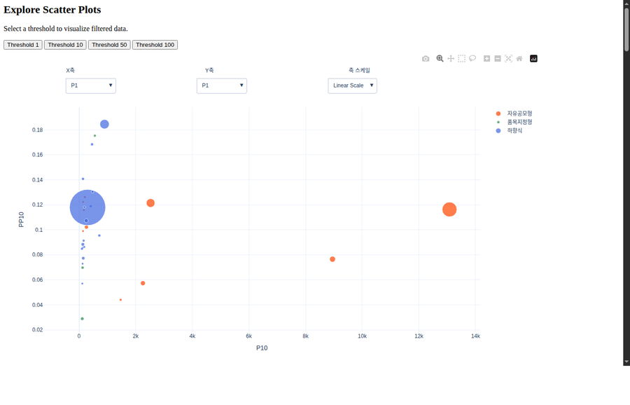
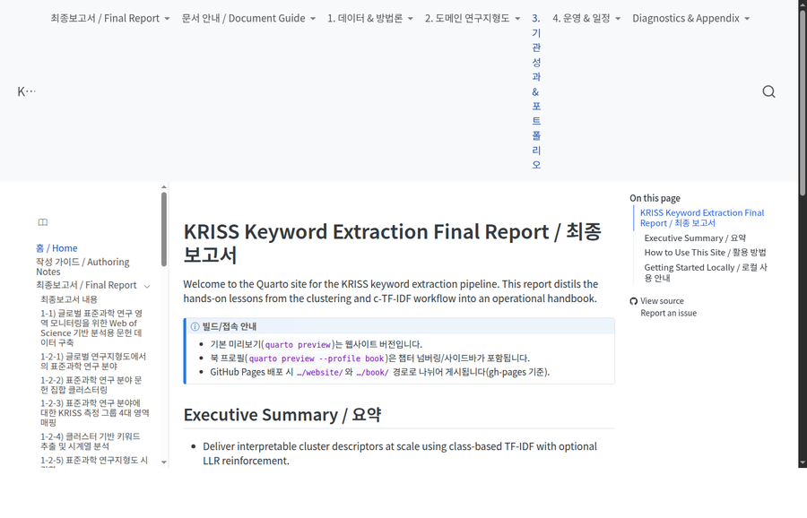
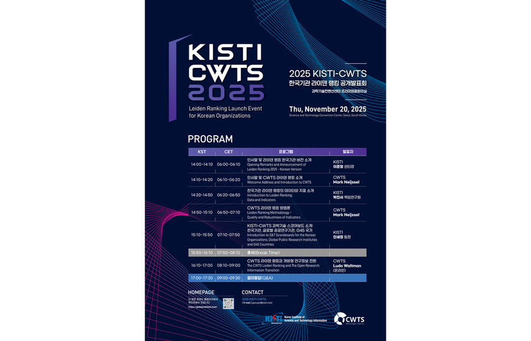

  
  

# GLOBAL R&D INSIGHT (글로벌R&D인사이트)

KISTI 글로벌R&D분석센터에서 구축한 글로벌 과학기술 이종데이터 및 분석 모델 기반으로 분석한 풍부한 자료를 각계 각층의 의사결정자가 쉽고 편리하게 활용할 수 있도록 지원합니다.

- 사이트: https://globalrnd.kisti.re.kr
- 사이트 소개: https://globalrnd.kisti.re.kr/about/site
- 데이터 인사이트: https://globalrnd.kisti.re.kr/datainsight
- 과학기술 스코어보드: https://globalrnd.kisti.re.kr/scoreboard

## Interactive Showcase

GitHub Pages 기반으로 공개 가능한 보고서/데모(인터랙티브 시각화 포함)를 제공합니다.

<table>
  <tr>
    <td width="50%">
      
       <b>Data Insight (NTIS 2024)</b>
       Plotly 기반 인터랙티브 산점도(Threshold/축 선택)
       <a href="https://kisti-globalrnd.github.io/Data-Insight-2024-ntis/">Demo</a> · <a href="https://github.com/KISTI-GlobalRnD/Data-Insight-2024-ntis">Repo</a>
    </td>
    <td width="50%">
      
       <b>KRISS Databook 2025</b>
       Quarto 기반 보고서(Website/Book) 공개
       <a href="https://kisti-globalrnd.github.io/kriss-databook-2025/website/">Website</a> · <a href="https://kisti-globalrnd.github.io/kriss-databook-2025/book/">Book</a> · <a href="https://github.com/KISTI-GlobalRnD/kriss-databook-2025">Repo</a>
    </td>
  </tr>
  <tr>
    <td width="50%">
      
       <b>OpenAlex User Forum KR</b>
       커뮤니티 자료/튜토리얼/발표자료 허브
       <a href="https://kisti-globalrnd.github.io/openalex-forum-kr/">Site</a> · <a href="https://github.com/KISTI-GlobalRnD/openalex-forum-kr">Repo</a>
    </td>
    <td width="50%">
      
       <b>2025 KISTI–CWTS Leiden Ranking</b>
       공개발표회 랜딩/사전등록 페이지
       <a href="https://kisti-globalrnd.github.io/2025-kisti-cwts-leidenranking/">Site</a> · <a href="https://github.com/KISTI-GlobalRnD/2025-kisti-cwts-leidenranking">Repo</a>
    </td>
  </tr>
</table>

## Public Projects

- `Home` — 조직 소개/링크 모음: https://github.com/KISTI-GlobalRnD/Home
- `Data-Insight-2024-ntis` — 데이터 인사이트 보고서 시범 공개(Plotly 대시보드): https://github.com/KISTI-GlobalRnD/Data-Insight-2024-ntis (Demo: https://kisti-globalrnd.github.io/Data-Insight-2024-ntis/)
- `kriss-databook-2025` — KRISS 키워드 추출 최종 보고서(Quarto): https://github.com/KISTI-GlobalRnD/kriss-databook-2025 (Website: https://kisti-globalrnd.github.io/kriss-databook-2025/website/, Book: https://kisti-globalrnd.github.io/kriss-databook-2025/book/)
- `2025-kisti-cwts-leidenranking` — 라이덴 랭킹 공개발표회 랜딩/사전등록: https://github.com/KISTI-GlobalRnD/2025-kisti-cwts-leidenranking (Site: https://kisti-globalrnd.github.io/2025-kisti-cwts-leidenranking/)
- `openalex-forum-kr` — OpenAlex 사용자 포럼 자료 허브: https://github.com/KISTI-GlobalRnD/openalex-forum-kr (Site: https://kisti-globalrnd.github.io/openalex-forum-kr/)

## 배경

전례 없이 빠르게 변화하는 글로벌 과학기술 환경 속에서, 국가 전략 수립과 R&D 혁신을 위한 선제적이고 신속한 의사결정 지원 체계가 필수적입니다.

- 코로나 19 팬데믹 이후 인공지능·반도체·바이오 등 첨단 기술 분야에서 글로벌 기술 패권 경쟁이 심화
- 공급망 불안정성, 지정학적 불확실성, 기후 변화 등 복합 위기 대응에서 과학기술의 역할이 중요
- 단편적/일회성 분석만으로는 변화의 흐름을 읽고 예측하는 데 한계

## 제공 서비스

KISTI 글로벌R&D분석센터는 논문, 특허, 펀딩 등 다양한 과학기술 데이터를 연계 분석할 수 있는 기반과 분석 모델을 구축해, 데이터 기반의 다면적 이해와 빠른 대응을 지원합니다.

## 원칙

분석 결과의 재현 가능성과 투명성에 대한 요구가 커지는 환경에서, 개방성과 투명성을 바탕으로 신뢰할 수 있는 분석 결과와 인사이트 제공을 지향합니다.

- 계량지표 비교·적용 맥락·해석 타당성에 대한 체계적 검증 강조
- 엄밀한 지표 활용과 지속적인 방법론 개선을 통한 신뢰성 확보

## 관련 링크

- KISTI: https://www.kisti.re.kr
- NTIS: https://www.ntis.go.kr
- ScienceON: https://scienceon.kisti.re.kr
- GitHub: https://github.com/KISTI-GlobalRnD/Home
- Zenodo: https://zenodo.org/communities/kisti_cgrd
- CWTS Leiden Ranking: https://www.leidenranking.com
- Barcelona Declaration: https://barcelona-declaration.org

---

본 README는 글로벌R&D인사이트의 "사이트 소개" 페이지(https://globalrnd.kisti.re.kr/about/site) 내용을 바탕으로 정리했습니다.
